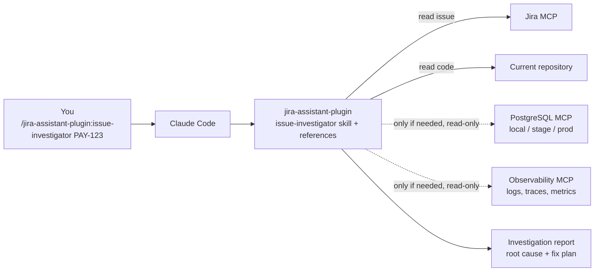
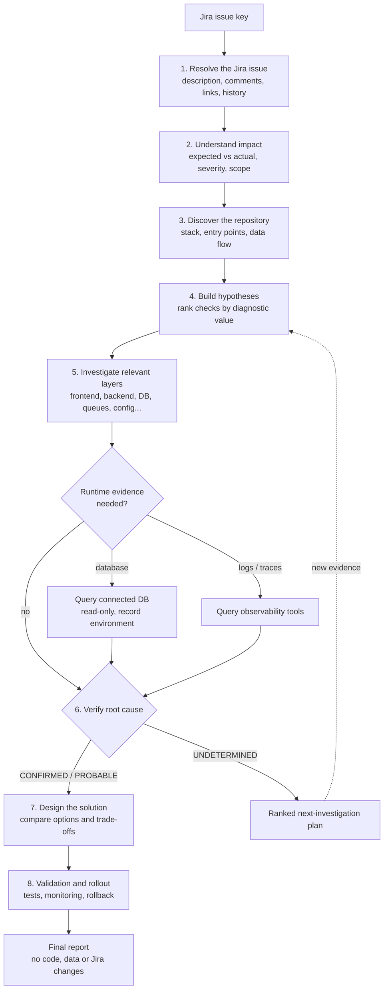

# Jira Assistant — Issue Investigator

An evidence-driven Claude Code plugin for investigating Jira defects and incidents in local, stage, or production environments across frontend, backend, database, integrations, infrastructure, and other relevant system layers.

## What it does

- Gathers available Jira issue context through your existing Jira MCP connection.
- Inspects the current source repository and relevant architecture.
- Dynamically identifies and investigates likely failure layers.
- Traces symptoms through code and dependencies.
- Separates confirmed root causes from probable causes and unknowns.
- Recommends a fix based on business correctness, technical quality, performance, scalability, security, reliability and maintainability.
- Produces a test, rollout and rollback plan.

## How it works

### Components

The plugin contains only instructions. All data comes from the tools
already connected in your Claude Code session.



Solid lines are always used. Dotted lines are used only when the evidence
calls for them and the connection exists. The environment is whichever
server your MCP configuration connects.

### Investigation flow



If a tool is missing or a query fails, the plugin continues and lists that
check as outstanding in the report instead of guessing.

## Requirements

- Claude Code installed and authenticated.
- An existing Jira MCP connection with access to the intended issues.
- The relevant source repository available in the Claude Code session.
- Authorized access to logs, metrics, traces or deployment history when the diagnosis requires them.

Jira MCP access and source-repository access are separate capabilities.

## Environments

The plugin is not tied to production. The environment it investigates
(local, stage, or production) is whichever server your MCP configuration
connects for the database and observability tools. The plugin identifies
that environment from the connection, records it in the report, and never
switches to another one. If the environment cannot be identified, the
report says so instead of guessing.

To investigate a different environment, point the MCP connection at that
environment's server before starting the session.

## Install

This plugin is installed through a Claude Code plugin marketplace, not npm.
Inside Claude Code (terminal, or the VS Code / Cursor extension), run:

```text
/plugin marketplace add Madhuri-Pawar/fintech-agent-skills
/plugin install jira-assistant-plugin@fintech-agent-skills
```

To install from a local clone instead, pass the path to the repository root:

```text
/plugin marketplace add ./fintech-agent-skills
/plugin install jira-assistant-plugin@fintech-agent-skills
```

To get updates later, run `/plugin marketplace update fintech-agent-skills`.

### Enable it for a whole team

Add this to the project's `.claude/settings.json`. Teammates who open and
trust the project are prompted to install the plugin:

```json
{
  "extraKnownMarketplaces": {
    "fintech-agent-skills": {
      "source": {
        "source": "github",
        "repo": "Madhuri-Pawar/fintech-agent-skills"
      }
    }
  },
  "enabledPlugins": {
    "jira-assistant-plugin@fintech-agent-skills": true
  }
}
```

Cursor's built-in chat cannot load Claude Code plugins. Use the Claude Code
extension inside Cursor instead.

## Test the plugin locally

From the repository root (the directory that contains `jira-assistant-plugin/`):

```bash
python jira-assistant-plugin/tests/validate_plugin.py
claude --plugin-dir ./jira-assistant-plugin
```

The `claude` command starts Claude Code with this plugin directory loaded. Jira, PostgreSQL, and observability servers stay in the user's MCP configuration. This plugin does not ship those connections.

## Investigate a Jira issue

Inside Claude Code, invoke:

```text
/jira-assistant-plugin:issue-investigator PAY-123
```

Replace `PAY-123` with the actual Jira issue key.

Alternatively, ask naturally:

```text
Investigate Jira issue PAY-123. Read the full available ticket context,
inspect this repository, identify the relevant failure layers, verify the
root cause using evidence, and give me a prioritized fix plan. Do not
modify code or Jira.
```

## Expected report

1. Issue understanding and business impact.
2. Relevant architecture and execution flow.
3. Findings grouped by affected layer.
4. Concrete repository paths and verified line ranges.
5. Root cause with evidence and confidence status.
6. Preferred fix and alternatives.
7. Business, technical, scalability and security trade-offs.
8. Implementation steps and regression tests.
9. Rollout, monitoring and rollback plan.
10. Remaining questions and missing evidence.

## Safety

The default workflow is read-only and plan-first. It must not modify
data in any connected environment, deploy code, change Jira fields, or post comments during
investigation.

Review any proposed commands before execution. Follow your organization's
access policies and production change controls.

## Limitations

A plugin cannot retrieve data that its connected tools cannot access.
The report must identify unavailable repositories, inaccessible ticket
details, and missing runtime evidence.

Static code inspection does not automatically prove that a particular
code path caused the reported failure. The plugin must not claim a
confirmed root cause without sufficient evidence.

## Tests

See `tests/README.md` for structural validation and behavioral test cases.
